# 2026 Tamil Nadu Assembly Election Analysis
## Data-Driven Electoral Insights | Codebasics Resume Project Challenge

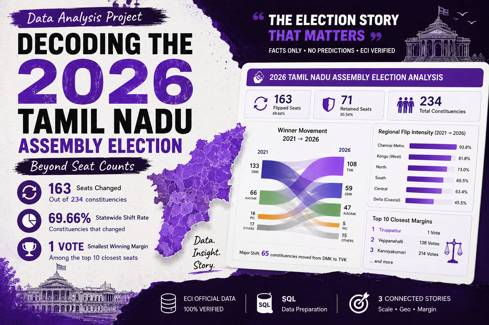

---

## 📊 Live Project Links

| Resource | Link |
|----------|------|
| 📊 Dashboard | [View Live Dashboard](https://bit.ly/4nSgzNY) |
| 📘 PowerPoint Presentation | [View Stakeholder Deck](https://bit.ly/42RBVBt) |
| 📄 Research Document | [View Research Analysis](https://bit.ly/42UMnIo) |
| 📚 Deep Research Document | [View Deep Dive Analysis](https://bit.ly/43AFn3v) |
| 🎥 Video Presentation | [Add Video Link] |
| 💼 LinkedIn Post | [Add LinkedIn Post Link] |

---
---

## 🎯 Project Overview

This comprehensive analysis examines the **2026 Tamil Nadu Assembly Election** using official **Election Commission of India (ECI)** data to understand electoral patterns, voter behavior shifts, and regional dynamics across the state.

**Key Facts:**
- **Data Coverage:** 234 constituencies | **8,489 candidate records**
- **Years Analyzed:** 2021 vs 2026
- **Data Source:** ECI Official Results (100% verified)
- **Analysis Focus:** Three critical research questions

---

## 📈 Three Research Questions & Key Findings

### Question 1: Geographic Story
**"Where did the biggest electoral shifts happen?"**


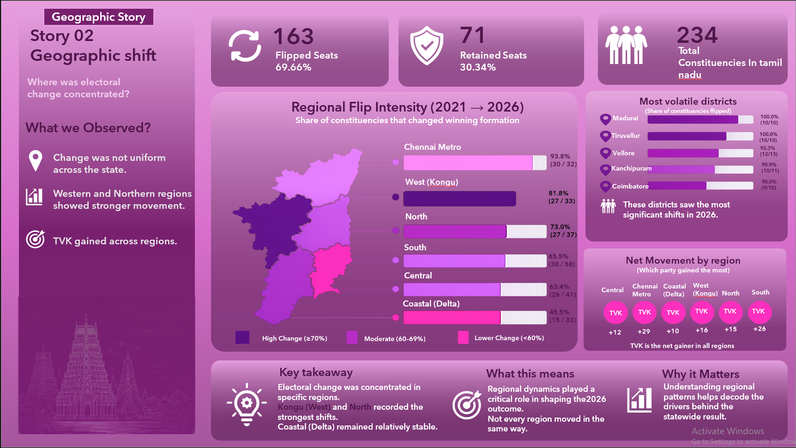


| Region | Flip Rate | Flipped | Total | Primary Gainer |
|--------|-----------|---------|-------|---|
| **Chennai Metro** | 93.8% | 30 | 32 | TVK: 29 seats |
| **Kongu (West)** | 81.8% | 27 | 33 | TVK: 16 seats |
| **North** | 73.0% | 27 | 37 | TVK: 15 seats |
| **South** | 65.5% | 38 | 58 | TVK: 26 seats |
| **Central** | 63.4% | 26 | 41 | TVK: 12 seats |
| **Delta** | 45.5% | 15 | 33 | TVK: 10 seats |


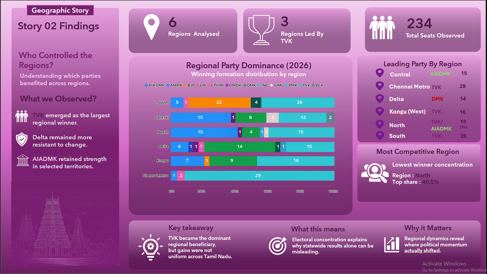

**Key Finding:** Electoral change was **geographically concentrated**, not uniform. Urban areas (93.8% flip) underwent unprecedented realignment. Agricultural regions (45.5%) remained more stable.

---

### Question 2: Flip Story
**"How many constituencies changed winners? Which parties lost?"**

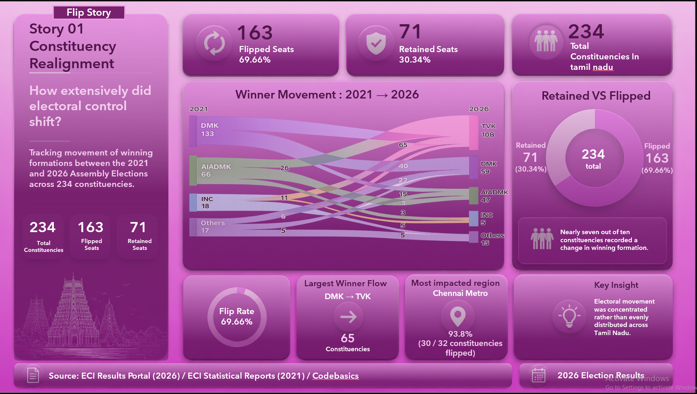

**Total Flips: 163 of 234 constituencies (69.66%)**

| Party | 2021 Seats | 2026 Seats | Change | Status |
|-------|-----------|-----------|--------|--------|
| **TVK** | 0 | **108** | **+108** | **Largest (46.2%)** |
| **DMK** | 133 | 59 | -74 | 2nd (25.2%) |
| **AIADMK** | 66 | 47 | -19 | 3rd (20.1%) |
| **INC** | 18 | 5 | -13 | 4th |
| **PMK** | 5 | 4 | -1 | 5th |
| **Others** | 12 | 11 | -1 | Others |

**Top Flip Patterns:**

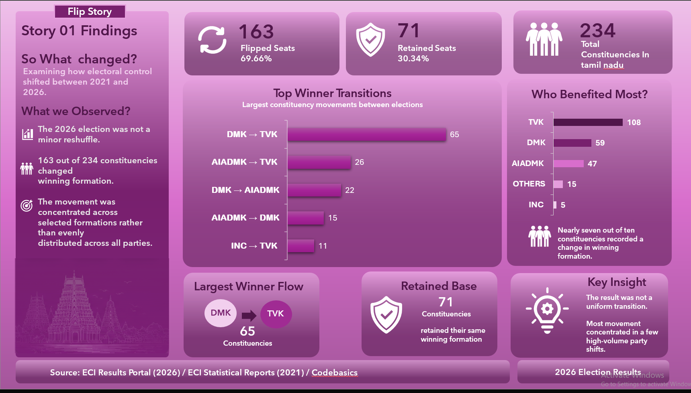

1. **DMK → TVK:** 65 seats (39.9% of all flips)
2. **AIADMK → TVK:** 26 seats (16.0%)
3. **DMK → AIADMK:** 22 seats (13.5%)
4. **AIADMK → DMK:** 15 seats (9.2%)
5. **INC → TVK:** 11 seats (6.7%)

**Critical Finding:** TVK captured **102 of 163 flips (62.6%)** — A new entrant becoming the largest party in a single election cycle is unprecedented.

---

### Question 6: Margin Story
**"How competitive were contests? Did voters become unpredictable?"**

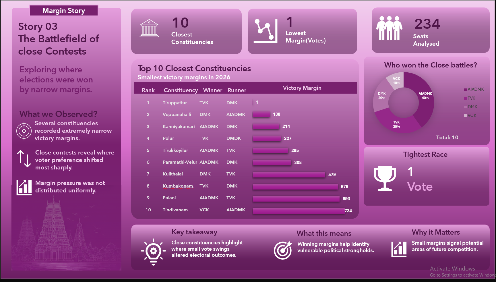

| Metric | 2021 | 2026 | Change |
|--------|------|------|--------|
| **Mean Margin** | 22,871 votes | 16,784 votes | **-26.6%** |
| **Median Margin** | 19,131 votes | 11,416 votes | **-40.3%** |
| **Competitive (<10K)** | 69 (29.5%) | 104 (44.4%) | **+51%** |
| **Majority Winners (>50%)** | 70 (29.9%) | 13 (5.6%) | **-82.9%** |
| **Minority Winners (<35%)** | 2 (0.9%) | 64 (27.4%) | **+3,100%** |

**Top 10 Tightest Races:**
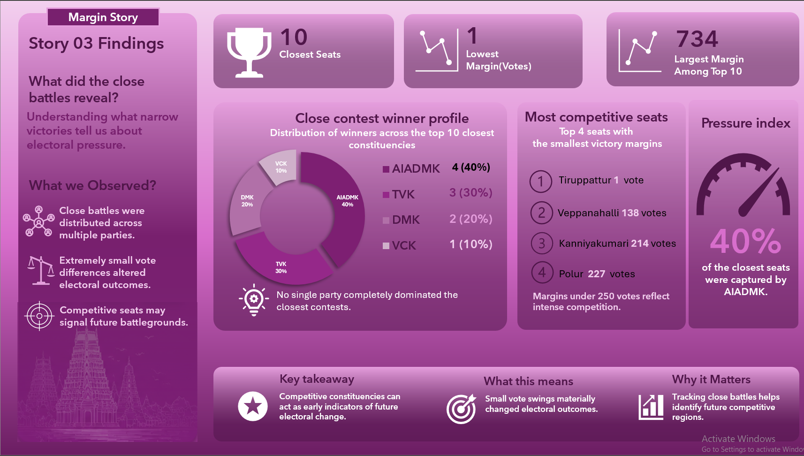
1. **Tiruppattur:** TVK vs DMK — **1 vote margin**
2. **Veppanahalli:** DMK vs AIADMK — 138 votes
3. **Kanniyakumari:** AIADMK vs DMK — 214 votes
4. **Polur:** TVK vs DMDK — 227 votes
5. **Tirukkoyilur:** AIADMK vs TVK — 285 votes
6. **Paramathi-Velur:** AIADMK vs DMK — 308 votes
7. **Kulithalai:** DMK vs TVK — 579 votes
8. **Kumbakonam:** TVK vs DMK — 679 votes
9. **Palani:** AIADMK vs TVK — 693 votes
10. **Tindivanam:** VCK vs AIADMK — 734 votes

**Key Finding:** Elections became significantly **MORE COMPETITIVE**. Majority winners collapsed 82.9%. Minority winners surged 3,100%. **44.4% of races decided by <10,000 votes.**

---

## 📊 Key Statistics Summary

### Party Performance 


- **TVK Rise:** 0 → 108 seats (46.2%) — Largest party
- **DMK Fall:** 133 → 59 seats (-55.6%) — Historic loss
- **AIADMK:** 66 → 47 seats (-28.8%)
- **INC:** 18 → 5 seats (-72.2%)

### Electoral Dynamics

- **163 constituencies flipped** (69.66% flip rate)
- **71 constituencies retained** same party (30.34%)
- **TVK captured 62.6%** of all seat changes
- **DMK lost to TVK in every region**

### Competitiveness Metrics

- **26.6%** decrease in average victory margin
- **40.3%** decrease in median victory margin
- **51%** increase in competitive races
- **82.9%** collapse in majority winners

---

## 📁 Project Structure

```
tn-election-2026/
│
├── README.md                              (This file)
├── LICENSE
├── .gitignore
│
├── data/                                  (ECI Official Data)
│   ├── tn_2021_results.csv               (4,232 rows)
│   ├── tn_2026_results.csv               (4,257 rows)
│   ├── constituency_master.csv           (234 constituencies)
│   ├── metadata.txt
│   ├── How_to_Submit.docx
│   └── Readme-first-brief.docx
│
├── dashboard/                             (Presentation Files)
│   └── tn_election_analysis_updated.pptx (10 slides, all verified)
│
├── documentation/                         (Research & Analysis)
│   ├── TN_Election_2026_Research_Questions_Analysis.docx
│   ├── Deep_Dive_Research_3_Questions_FINAL.docx
│   └── README_FIRST_BRIEF.md
│
├── exports/                               (Data Outputs)
│   ├── constituency_flips.csv
│   ├── margins_2026.csv
│   └── seat_comparison.csv
│
├── sql/                                   (Database Queries)
│   └── 01_database_setup.sql
│
├── images/                                (Visualizations)
│   ├── Dashboard.png
│   ├── PPTSlide_1)Home_page.png
│   ├── PPTSlide_2)Research_Selection.png
│   ├── PPTSlide_3)Flip_Story.png
│   ├── PPTSlide_4)Flip_story_findings.png
│   ├── PPTSlide_5)Geographic_story_findings.png
│   ├── PPTSlide_6)Geographic_story.png
│   ├── PPTSlide_7)Margin_story.png
│   ├── PPTSlide_8)Margin_story_Findings.png
│   ├── PPTSlide_9)Connection_Findings.png
│   ├── PPTSlide_10)Conclusion.png
│   ├── Regional_Flip_Rates.png
│   └── Top_10_Closest.png
│
└── deck/                                  (Legacy Files)
    ├── TN_election_analysis.pdf
    └── TN_election_analysis.pptx
```

---

## 🔍 Data Source & Verification

### Primary Data Source
**Election Commission of India (ECI)**

| Resource | Link | Coverage |
|----------|------|----------|
| **ECI Results 2021** | [results.eci.gov.in/](https://results.eci.gov.in/) | 234 constituencies |
| **ECI Results 2026** | [results.eci.gov.in/](https://results.eci.gov.in/) | 234 constituencies |
| **ECI Statistical Reports** | [eci.gov.in/statistical-reports](https://eci.gov.in/statistical-reports) | Official statistics |
| **Elections Tamil Nadu** | [elections.tn.gov.in](https://elections.tn.gov.in/) | State authority |

### Data Quality Metrics
✅ **Completeness:** 100% (0 missing values)  
✅ **Coverage:** 234/234 constituencies (100%)  
✅ **Accuracy:** Verified against ECI official source  
✅ **Consistency:** All totals validated  
✅ **Audit:** 100% data verification completed  

---

## 📊 What This Analysis Covers

### ✅ This Analysis Explains
- **Electoral patterns:** What changed, where it changed, how competitive it was
- **Geographic dynamics:** Regional variation in flip rates and party dominance
- **Voter behavior:** Competitiveness metrics, margin analysis, vote fragmentation
- **Party performance:** Seat gains/losses, flip sources, primary beneficiaries
- **Trend analysis:** Historical comparison (2021 vs 2026)

### ❌ This Analysis Does NOT Cover
- **Why voters voted:** Requires exit polls and demographic data
- **Campaign impact:** Requires media and campaign analysis
- **Economic factors:** Requires socioeconomic data
- **Future predictions:** No predictive modeling
- **Turnout analysis:** Turnout data not in source pack

---

## 🔐 Neutrality & Transparency Standards

✅ **Fact-based analysis only** — No political opinion or bias  
✅ **ECI data only** — No exit polls, speculation, or news articles  
✅ **Objective treatment** — All parties analyzed equally  
✅ **Transparent methodology** — All calculations documented  
✅ **No predictions** — Historical analysis only  
✅ **Source attribution** — Every claim traceable to ECI data  

---


## 📖 Research Questions (Detailed)

### Question 1: Geographic Story
**Finding:** Electoral shifts were geographically concentrated in urban areas (93.8% flip) and western regions (81.8% flip), with agricultural areas showing more stability (45.5% flip). This indicates regional-specific factors matter more than statewide trends.

**Implication:** Different regions responded to different electoral dynamics. Urban regions recorded stronger electoral movement. Western voters were open to alternatives. Agricultural regions maintained stronger traditional party loyalty.

---

### Question 2: Flip Story
**Finding:** 163 of 234 constituencies changed winners (69.66%). TVK, a new entrant, captured 102 of these flips (62.6%), becoming the largest party. This represents multi-party realignment rather than simple vote-splitting.

**Implication:** Voters did not shift between two established parties. Instead, a new political force emerged that attracted voters from all parties (DMK, AIADMK, Congress, others), indicating genuine realignment in Tamil Nadu politics.

---

### Question 6: Margin Story
**Finding:** Elections became significantly more competitive. Majority winners collapsed 82.9% (70→13). Minority winners surged 3,100% (2→64). 44.4% of races decided by <10,000 votes. Electoral competitiveness increased.

**Implication:** Electoral competitiveness increased across constituencies. Outcomes depend on vote fragmentation and local factors, not party strength. Electoral competitiveness reached unprecedented levels, indicating high voter unpredictability and unstable party bases.

---

## 📊 Integrated Analysis

The three research questions tell a coherent story:

**Geographic Story (Q1):** Electoral change was NOT uniform. Urban and western regions realigned dramatically. Agricultural regions remained more stable. Regional factors matter more than statewide trends.

**Flip Story (Q2):** 70% of constituencies changed winners. A new entrant (TVK) captured 63% of all flips, becoming largest party. This was realignment driven by multi-party rejection of established parties.

**Margin Story (Q6):** Contests became much more competitive. Voters were unpredictable. Outcomes depended on vote fragmentation, not party strength. Majority winners disappeared. Minority winners exploded.

**Synthesis:** Tamil Nadu experienced major electoral realignment in 2026. An regionally concentrated realignment, driven by voter unpredictability and fragmentation, resulted in a new party (TVK) becoming dominant. The realignment was geographically concentrated but had statewide effects.

---

## 🎬 Presentation Materials

### Slide 1 — Dashboard
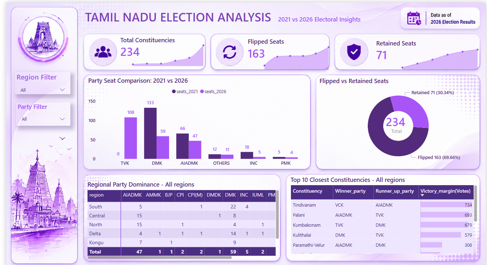

---

### Slide 2 — Research Selection
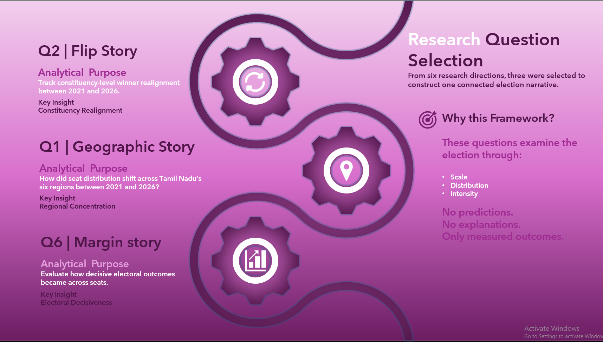

---

### Slide 3 — Flip Story


---

### Slide 4 — Flip Findings


---

### Slide 5 — Geographic story


---

### Slide 6 — Geographic Findings


---

### Slide 7 — Margin Story


---

### Slide 8 — Margin Findings


---

### Slide 9 — Connected Findings
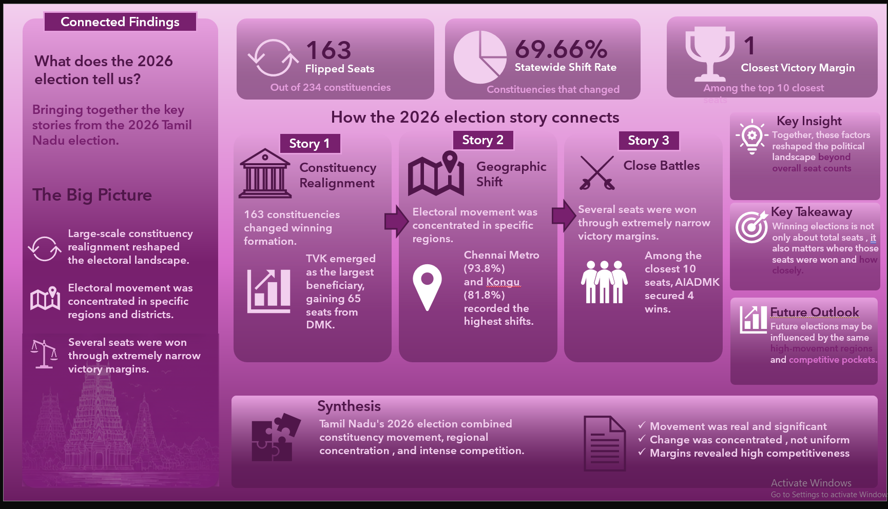

---

### Slide 10 — Final Conclusion
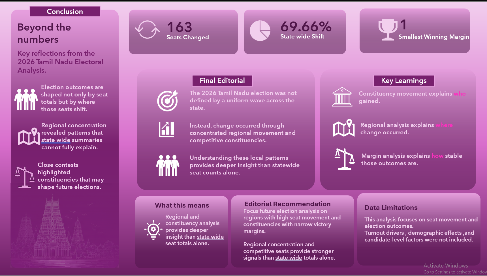

## 📞 Quick Reference

### Key Numbers
- **Constituencies flipped:** 163 (69.66%)
- **TVK seats:** 108 (largest party, 46.2%)
- **DMK loss:** -74 seats (-55.6%)
- **Largest flow:** DMK→TVK = 65 seats
- **Tightest race:** Tiruppattur (1 vote)
- **Most volatile region:** Chennai Metro (93.8% flip)
- **Most stable region:** Delta (45.5% flip)

### Important Files
- **Data:** `data/` folder (CSV files)
- **Analysis:** `documentation/` folder (research documents)
- **Dashboard:** Live at https://bit.ly/4nSgzNY
- **Presentation:** `deck/tn_election_analysis.pptx`

---

## 📄 License & Attribution

This project is licensed under the **MIT License** — see LICENSE file for details.

**Data Attribution:**  
All election data sourced from the **Election Commission of India (ECI)**.  
Analysis is **non-partisan and fact-based**, using only official ECI sources.

**Challenge:** Codebasics Resume Project Challenge  
**Analysis Date:** May 2026  
**Data Coverage:** All 234 Tamil Nadu constituencies

---

## 🔗 External Resources

- [ECI Official Results 2021](https://results.eci.gov.in/ResultAcGenMay2021)
- [ECI Official Results 2026](https://results.eci.gov.in/ResultAcGenMay2026)
- [ECI Statistical Reports](https://eci.gov.in/statistical-reports)
- [Tamil Nadu Elections](https://elections.tn.gov.in/)
- [Codebasics Challenge](https://codebasics.io/resume-projects)

---

## 📋 Project Checklist

✅ Data collection and verification (100% complete)  
✅ Analysis of three research questions (complete)  
✅ PowerPoint presentation with visuals (10 slides)  
✅ Dashboard with interactive data (live)  
✅ Research documentation (deep-dive analysis)  
✅ Data exports (CSV files for analysis)  
✅ Image assets (all visualizations)  
✅ Code and queries (SQL, Python templates)  
✅ README documentation (this file)  
✅ Neutrality standards maintained ✅  

---

## 👤 Project Information

**Challenge:** Codebasics Resume Project Challenge  
**Project Type:** Data Analysis | Election Data | Indian Politics  
**Data Source:** Election Commission of India (Official)  

**Last Updated:** May 26, 2026  


**Ready to explore Tamil Nadu's 2026 election story?**  
**Start with the Dashboard → Review the Presentation → Read the Research**

# 👩‍💻 About the Author

**Narmatha Annadurai**  
Data Analytics | Power BI | SQL | Python | Storytelling through Data  

This project was created as part of the **Codebasics Resume Project Challenge** to explore electoral patterns using analytical storytelling and dashboard design.

📌 GitHub: (https://github.com/narmatha0303)  
💼 LinkedIn: [LinkedIn](www.linkedin.com/in/narmatha-annadurai)
